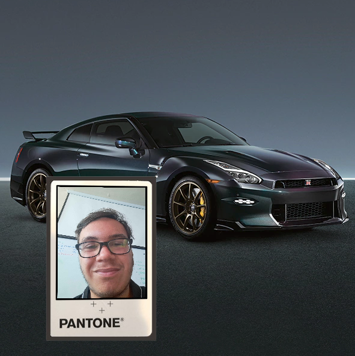

<h1> OpenCV Augmented Reality (AR) - IMSAR PROJECT</h1>
 
<h2>Features</h2>
<ul>
    <li>opencv_ar_image.py: augmented reality with an image for input and source to put on the image</li>
    <li>camera_live_ar_image.py: augmented reality on live camera feed</li>
</ul>

<h2>Acknowledgments</h2>

<b> Python3: http://bit.ly/python3-certifications </b>
 
<b> Machine Learning: https://bit.ly/machine-learning-certification <b>
 

<h2>Photo</h2>

 
<h2>Contact</h2>

<b> Email: mariusc0023@gmail.com </b>
